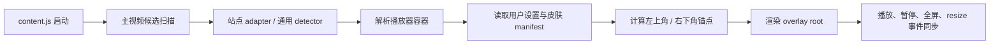

# Aura Chrome 插件 MVP 方案（角落动态主题版）

> 状态：Confirmed  
> 适用范围：Chrome MV3 桌面插件  
> 说明：本方案用于替代“上下黑边主题框”主线，转向“视频容器角落动态主题挂件”方案。旧方案文档保留作历史参考，不作为当前 MVP 的实施依据。

## 1. 方案摘要

### 1.1 一句话定义
Aura 是一个 Chrome 追剧氛围插件：在视频播放器的左上角和右下角挂载轻量动态主题装饰，让观众在不遮剧情的前提下，获得持续、克制、可爱的陪伴感。

### 1.2 为什么转向
- 黑边检测对站点 DOM、播放器布局、全屏模式依赖过强，维护成本高。
- 角落挂件只需要稳定识别视频容器，不需要精确测量黑边厚度，更容易跨站点复用。
- 主题角色、皮肤和动效更容易形成产品记忆点，而不只是一个几何覆盖功能。

### 1.3 MVP 目标
做出一个可安装、可启用、可持续观看一整集的 Chrome 插件，并满足以下四点：
- 在腾讯视频播放页稳定识别主视频和播放器容器。
- 自动在左上角和右下角渲染轻量动态主题挂件。
- 提供 1 个原创主角色和 3 套剧种模板皮肤。
- 全程低打扰、可关闭、可调节，并保持固定安全区布局。

### 1.4 当前推荐结论
- 产品方向：成立。
- 首发平台：Chrome 浏览器插件。
- 官方首发支持：腾讯视频。
- 架构策略：检测逻辑通用化，后续低成本扩到优酷、爱奇艺、哔哩哔哩。
- MVP 不接 LLM，不做字幕/弹幕语义理解，不做全黑边主题框。

## 2. 产品原则

### 2.1 不抢戏
- 主题挂件始终是“陪衬”，不能压过视频内容本身。
- 默认动效必须慢、轻、小。
- 所有动画都必须可关闭或降级。

### 2.2 先锚定视频容器，再做视觉效果
- 所有挂件都锚定在“主视频容器”上，而不是浏览器窗口上。
- 识别不到稳定视频容器时，宁可不显示，也不硬显示。

### 2.3 固定角色，模板换装
- MVP 只做 1 个主角色：原创小猫。
- 皮肤通过服饰、配件、配色和角标装饰做差异化。
- 不做多个主角色并行生产。

### 2.4 AI 负责增产素材，不负责定义系统
- 皮肤必须模板化，方便 AI 批量生产素材。
- 动效逻辑由代码统一控制，不依赖 AI 生成动态视频。
- 最终风格统一性由模板和人工筛选保证。

### 2.5 官方支持和实验支持分层
- 对外口径：支持主流视频网站中的适配页面。
- 工程口径：腾讯视频先打透，其他站点只做实验支持或下一阶段接入。

## 3. 目标用户与核心场景

### 3.1 目标用户
- 重度追剧用户
- 喜欢有主题感、仪式感的观影体验用户
- 喜欢可爱挂件、桌宠、情绪化视觉陪伴的用户
- 能接受安装浏览器插件的用户

### 3.2 核心场景
1. 用户打开腾讯视频播放页并开始播放，Aura 自动出现。
2. 左上角出现轻量类型角标，右下角出现小猫主题挂件。
3. 用户切换全屏或网页全屏时，挂件自动跟随播放器容器重定位。
4. 用户在 popup 中切换“悬疑 / 古偶 / 热血”皮肤，页面即时更新。

## 4. MVP 范围

### 4.1 必做功能

#### A. 主视频与容器检测
- 检测当前页面中最可能的主视频元素。
- 解析与视频对应的播放器容器。
- 支持窗口态、网页全屏、浏览器全屏。
- 多 video 场景下只选择一个主视频目标。

#### B. 角落主题挂件渲染
- 左上角渲染轻量装饰挂件。
- 右下角渲染主角色挂件。
- 挂件默认锚定视频容器，不脱离播放器。
- 默认低频微动，事件触发时短暂增强。

#### C. 主题皮肤系统
- 1 个原创小猫主角色。
- 3 套剧种模板皮肤：
  - 悬疑
  - 古偶
  - 热血
- 每套皮肤包含：
  - 角色服饰/配件
  - 左上角装饰
  - 右下角挂件主体
  - 粒子/小特效预设

#### D. 用户可控设置
- 总开关
- 动效强度：`安静 / 标准 / 活泼`
- 主题模式：`自动推荐 / 手动选择`

#### E. 站点适配策略
- 腾讯视频：官方支持，作为 MVP 主验收站点。
- 其他站点：代码结构预留通用检测能力，但不以“稳定支持”作为 MVP 承诺。

### 4.2 可做但不承诺进入首版
- 切集时的小彩蛋动效
- 站点级别开关
- 热门剧关键词自动推荐更细皮肤

### 4.3 明确不做
- 上下黑边主题框
- LLM 对话
- 字幕/弹幕语义理解
- 语音陪看
- 远端账号体系
- 主题市场
- Mac App / iOS App
- 未授权 IP 角色复刻

## 5. 对外口径与站点策略

### 5.1 推荐对外表述
建议产品对外说法为：

> Aura 是一个追剧氛围插件，在适配的视频播放页为你挂上轻量动态主题装饰。

不要在 MVP 阶段直接承诺“所有主流网站都稳定支持”。

### 5.2 推荐工程策略
- 第一阶段只把腾讯视频做成官方稳定站点。
- 检测和渲染架构按“通用视频站点”设计。
- 第二阶段再扩充优酷、爱奇艺、哔哩哔哩的专用 adapter。

### 5.3 为什么不建议一开始就全站点宣称支持
- Chrome 权限范围会变大，影响信任感。
- 各站点 DOM 和全屏逻辑差异仍然存在。
- 真正难点从“黑边识别”变成了“稳定锚定播放器容器”，依旧需要逐站点验证。

## 6. 体验与交互规范

### 6.1 页面内布局
- 左上角：轻量装饰，不可拖拽。
- 右下角：主角色挂件，不可拖拽。
- 两者都锚定在视频容器内部，而不是浏览器窗口。

### 6.2 安全区规则
- 左上角挂件宽度建议为视频容器宽度的 `10% ~ 14%`，最大不超过 `180px`。
- 右下角挂件宽度建议为视频容器宽度的 `12% ~ 18%`，最大不超过 `240px`。
- 默认边距：
  - 左上角：距容器左侧 `16px`，距顶部 `16px`
  - 右下角：距容器右侧 `16px`，距底部 `72px`
- 全屏态自动缩小 `10% ~ 15%`，并略微上移，避免压住控制条区域。

### 6.3 字幕与控制条避让
- MVP 不做字幕识别，但必须遵守底部安全边距。
- 当播放器控制条显式出现时，右下角挂件自动降低不透明度或上移一档。
- 鼠标进入右下角控制区附近时，挂件可临时半透明，避免抢交互。

### 6.4 固定定位规则
- MVP 不支持拖拽，避免实现复杂度和遮挡风险扩散。
- 右下角挂件始终固定在视频容器安全区内。
- 底部中央字幕高风险区保持禁入。
- 后续如果要支持拖拽，必须作为单独版本需求评估。

### 6.5 动效规则
- 常驻动效：呼吸、眨眼、轻微摆动。
- 事件动效：播放开始、暂停、恢复播放、切换主题、进入全屏。
- 禁止持续高闪、快速缩放、大片粒子飘落。
- 页面不可见、标签页切后台时暂停非必要动画。

### 6.6 popup 交互建议
当前 popup 需要从“黑边诊断台”转成“主题挂件控制台”：
- 开关
- 当前站点支持状态
- 当前主题
- 自动/手动主题选择
- 动效强度
- 调试区折叠显示：
  - `videoDetected`
  - `containerSource`
  - `renderState`
  - `skinId`
  - `playbackMode`

## 7. 皮肤模板系统

### 7.1 模板化目标
皮肤不能是一张完整大图，而必须是可组合模板，方便：
- AI 生成分层素材
- 批量换装
- 统一代码动画
- 快速扩展新剧种或热点活动

### 7.2 统一模板结构
每套皮肤建议固定以下层级：
- `base_character`：固定小猫底模
- `costume_layer`：服饰层
- `prop_layer`：配件层
- `top_left_decor`：左上角装饰层
- `bottom_right_shell`：右下角主体外观层
- `particle_preset`：粒子或闪光素材
- `copy_tone`：预留文案语气包字段（首版不启用）
- `motion_preset`：动效预设

### 7.3 推荐皮肤包 manifest

```json
{
  "id": "genre-suspense-cat-v1",
  "name": "悬疑猫",
  "category": "genre",
  "genre": "suspense",
  "character": {
    "baseId": "mimi-cat",
    "costume": "detective-hat",
    "expressionPack": "suspense-pack-a"
  },
  "anchors": {
    "topLeft": {
      "asset": "top-left-decor.png",
      "widthRatio": 0.12,
      "maxWidth": 180,
      "offsetX": 16,
      "offsetY": 16
    },
    "bottomRight": {
      "asset": "bottom-right-cat.png",
      "widthRatio": 0.16,
      "maxWidth": 240,
      "offsetX": 16,
      "offsetY": 72,
      "draggable": true
    }
  },
  "motionPreset": "peek-soft",
  "particlePreset": "dust-spark-low",
  "copyTone": {
    "welcome": "线索猫到位，开看。",
    "pause": "暂停也别丢线索。"
  },
  "palette": {
    "primary": "#20424f",
    "accent": "#e0b86e",
    "glow": "#85b8d9"
  }
}
```

### 7.4 推荐资源目录

```text
themes/
├── manifests/
│   └── builtin-skins.json
└── skins/
    └── genre-suspense-cat-v1/
        ├── manifest.json
        ├── preview.png
        ├── top-left-decor.png
        ├── bottom-right-cat.png
        ├── particles-spark.svg
        ├── expression-idle.png
        ├── expression-happy.png
        └── expression-pause.png
```

### 7.5 资源格式建议
- 静态角色与装饰：PNG 或 WebP 透明图。
- 粒子或简单图形：优先 SVG。
- 动效：优先 CSS Transform / Web Animations API。
- MVP 不建议把 GIF 或长循环视频作为主资源格式。

### 7.6 AI 生成规范
AI 素材生成必须遵守固定模板：
- 透明背景
- 固定主朝向
- 固定画幅
- 固定角色比例
- 固定线条粗细范围
- 固定色板上限
- 不允许生成超出挂件边界的大面积飘散主体

### 7.7 AI 生成最适合负责的部分
- 服饰变体
- 配件变体
- 左上角装饰
- 角落花纹
- 表情变体

### 7.8 AI 不适合直接负责的部分
- 角色系统定义
- 动效节奏
- 交互热点区
- 多皮肤间的一致比例

## 8. 技术架构

### 8.1 核心思路
复用当前 Chrome MV3 插件骨架，但把核心运行时从“黑边测量与 top/bottom render”转成：
- 主视频检测
- 容器锚定
- 角落布局
- 皮肤解析
- 轻量动画控制

### 8.2 运行时数据流



### 8.3 检测层设计

#### 通用 detector
负责：
- 扫描页面可见 video
- 为候选 video 打分
- 选出主视频
- 找到最可能的容器节点

打分可参考：
- 可见面积
- 与 viewport 的重叠程度
- 是否处于播放态
- 是否在中心区域
- 是否位于播放器 shell 内
- 是否处于全屏或网页全屏容器中

#### 腾讯视频 adapter
负责：
- 页面 gate
- 播放器容器优先级
- 标题/集数读取
- 控制条区域估算
- 网页全屏态细节补丁

### 8.4 渲染层设计
- 只注入一个 overlay root。
- overlay root 下维护两个 slot：
  - `top-left-slot`
  - `bottom-right-slot`
- 所有挂件默认 `pointer-events: none`，避免抢占播放器交互。
- 主动画尽量使用 transform/opacity，避免高频 layout。

### 8.5 状态与存储
建议新增或迁移到以下设置结构：

```json
{
  "enabled": true,
  "mode": "standard",
  "themeMode": "auto",
  "selectedSkinId": "genre-suspense-cat-v1"
}
```

说明：
- 首版不保存挂件偏移，统一使用固定安全区布局。

## 9. 对当前仓库的实施拆分建议

### 9.1 保留复用
- `apps/extension/manifest.json`：继续使用 MV3 壳子。
- `apps/extension/background.js`：继续负责快捷键和设置同步。
- `packages/theme-registry`：继续作为主题/皮肤 manifest 读取层。
- `popup` 基础结构：保留，但内容需改版。

### 9.2 建议新增模块

```text
packages/aura-engine/src/
├── playback-detector.js
├── playback-container.js
├── anchor-layout.js
├── overlay-controller.js
├── motion-controller.js
└── site-adapters/
    ├── generic.js
    └── tencent.js
```

### 9.3 建议改造点
- [apps/extension/content.js](/Users/kartz/Development/Aura/apps/extension/content.js)
  - 从“大一统黑边脚本”转成启动器 + runtime 编排层。
- [apps/extension/content.css](/Users/kartz/Development/Aura/apps/extension/content.css)
  - 删除 top/bottom band 样式主线，改成 corner slot 样式。
- [apps/extension/popup.html](/Users/kartz/Development/Aura/apps/extension/popup.html)
  - 用主题挂件状态替代黑边测量诊断。
- [apps/extension/popup.js](/Users/kartz/Development/Aura/apps/extension/popup.js)
  - 改成主题模式、动效模式和调试信息交互。
- [themes/manifests/builtin-skins.json](/Users/kartz/Development/Aura/themes/manifests/builtin-skins.json)
  - 当前运行时主线只保留双角素材 contract，不再沿用旧 `builtin-themes` 语义。

### 9.4 迁移策略
直接切换到新渲染模式：
- `renderMode = "corner-decor"`

不保留旧黑边代码作为过渡主线，后续实现以新模式为唯一运行链。

## 10. MVP 资源生产方案

### 10.1 首批皮肤建议
- 悬疑猫
- 古偶猫
- 热血猫

### 10.2 每套皮肤最低交付物
- 1 张右下角主挂件图
- 1 张左上角装饰图
- 1 套基础表情图
- 1 套粒子/闪光素材
- 可选 1 张 preview 图
- 1 份 manifest

### 10.3 生产流程
1. 确定剧种模板和色板。
2. 基于固定底模生成服饰/配件方案。
3. 生成左上角装饰和右下角主体素材。
4. 人工筛选并修正透明边缘和比例。
5. 写 manifest 并接入本地 registry。
6. 浏览器实机验证窗口态、全屏态、亮暗背景下观感。

## 11. 开发分期建议

### Phase 0：方案落地与清理
- 确认本方案为主线。
- 明确 `corner-decor` 命名、存储键、皮肤 manifest 结构。
- 停止旧黑边链路扩展，开始直接替换主运行链。

### Phase 1：基础运行链
- 通用主视频 detector
- 播放器容器锚定
- overlay root 与双 slot 注入
- 基础 CSS 动效

### Phase 2：皮肤系统
- `builtin-skins.json`
- 3 套首批皮肤接入
- popup 改版
- 自动 / 手动主题切换

### Phase 3：腾讯视频打透
- 腾讯 adapter
- 标题读取
- 网页全屏与全屏适配
- 控制条避让
- 切集与刷新稳定性

### Phase 4：验收与演示
- 性能和视觉 QA
- 边界页面回归
- 安装包演示版
- 准备下一阶段扩站点路线

## 12. MVP 验收标准

### 12.1 功能验收
- 腾讯视频播放页打开后，开始播放 `2 秒内` 完成挂件显示。
- 窗口态、网页全屏、浏览器全屏三种模式下位置稳定。
- popup 可切换 3 套皮肤并立即生效。
- 没有视频时，不显示残留挂件。

### 12.2 体验验收
- 不明显遮挡字幕和控制条。
- 动画默认不烦人，整集开启可接受。
- 视觉风格统一，不像临时贴纸。

### 12.3 工程验收
- 运行时无高频报错。
- 不依赖高频轮询作为主同步机制。
- 切集、刷新、全屏切换后不会重复注入多个 overlay root。

## 13. 主要风险与缓解

### 13.1 播放器容器识别仍有站点差异
缓解：
- 先把腾讯 adapter 做稳。
- 通用 detector 只作为扩展基础，不作为首发承诺。

### 13.2 右下角挂件仍可能压字幕
缓解：
- 默认高底边距。
- 控制条出现时上移或半透明。
- 固定布局下直接避开底部中央高风险区。

### 13.3 AI 生成素材风格飘
缓解：
- 固定底模。
- 先做模板化字段。
- 人工筛选后入库。

### 13.4 视觉疲劳
缓解：
- 默认 `标准` 而不是 `活泼`。
- 提供 `安静` 模式。
- 降低常驻动效频率。

## 14. 本方案的推荐默认决策

当前默认按以下已确认项推进：
- 首发站点：腾讯视频
- 主角色：原创小猫
- 首批皮肤：悬疑 / 古偶 / 热血
- 动效模式：`安静 / 标准 / 活泼`
- 左上角和右下角均为固定安全区挂件
- 不接 LLM
- 不做字幕/弹幕分析
- 不做全黑边主题框

## 15. 已确认项

已确认：
- MVP 首发皮肤确定为 `悬疑 / 古偶 / 热血`
- popup 不保留欢迎语短文案
- 右下角挂件不支持拖拽
- 不保留旧黑边代码作为过渡模式，直接开始替换主链
